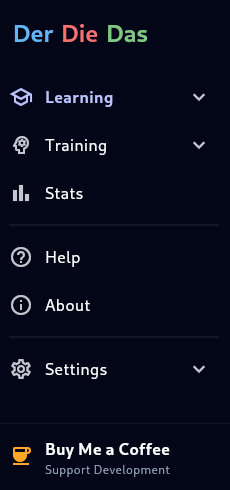
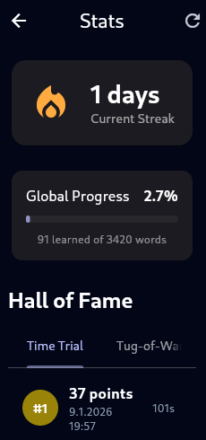
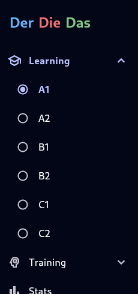
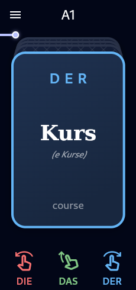

# DerDieDas - Master German Articles


<a href="https://t.me/XelvraFree" target="_blank"></a>

<a href="https://www.buymeacoffee.com/derdiedas" target="_blank"></a>

**DerDieDas** is a modern, cross-platform application designed to help learners master the most notoriously difficult aspect of the German language: noun articles (*Der, Die, Das*).

> 📱 **Mobile Optimized**
> While the app is cross-platform, it is **primarily optimized for mobile devices**. This ensures the best experience for gesture-based learning and full utilization of **audio features** like Text-to-Speech and Voice Control.

Built with **Flutter**, it leverages a sophisticated **Spaced Repetition System (SRS)** logic to ensure efficient long-term retention.

---

## 📸 Screenshots

<p align="center">
  
  
  
  
</p>

---

## ✨ Key Features

*   **🎓 Comprehensive Database:** Over 3,400 audited words categorized by levels (A1 to C2).
*   **🧠 Spaced Repetition (SRS):** Intelligent algorithm that tracks "weak points" and schedules reviews for optimal retention.
*   **👆 Gesture-Based Interface:** Intuitive Tinder-like swipe mechanics (Left for *Die*, Up for *Das*, Right for *Der*).
*   **🗣️ Voice Control (Hands-Free):** Practice and answer using your voice – perfect for learning on the go.
*   **🎮 Multiple Game Modes:** 6 different ways to practice (including Cinema Mode).
*   **🌍 Multi-language Support:** Fully localized in **German** (source), **English**, **Czech**, **Russian**, and **Slovak**.
*   **🎨 Customization:** 8+ visual themes, Dark/Light mode, haptic feedback, and **Text-to-Speech** (automated pronunciation).

---

## 🎮 Game Modes

1.  **Level Progress:** A structured learning path from easy to complex vocabulary.
2.  **Survival:** Race against the clock! Correct answers give you more time.
3.  **Challenge:** Test your knowledge without time pressure and track your high score.
4.  **Review Learned:** Specifically target words you have already mastered to ensure they stay in long-term memory.
5.  **Weak Points:** Focus exclusively on words where you frequently make mistakes (powered by SRS).
6.  **Autoplay (Cinema Mode):** Sit back and watch as the app automatically cycles through words with full audio support – perfect for passive learning.

---

## 🛠️ Tech Stack & Architecture

*   **Framework:** [Flutter](https://flutter.dev/) (Dart)
*   **State Management:** [Riverpod](https://riverpod.dev/) (Code generation)
*   **Local Database:** [SQLite](https://pub.dev/packages/sqflite) (Synchronized with audited CSV data)
*   **Architecture:** Layered Architecture (MVVM-style)
*   **CI/CD:** Automated GitHub Actions for testing and Web deployment.

---

## 🚀 Getting Started

### Installation

1.  **Clone & Install:**
    ```bash
    git clone https://github.com/der-die-das/der-die-das.git
    cd der-die-das
    flutter pub get
    ```

2.  **Generate Files:**
    ```bash
    flutter gen-l10n
    dart run build_runner build -d
    ```

3.  **Run:**
    ```bash
    flutter run
    ```

### Production Build (Manual)

To build the application for distribution outside of official stores:

*   **Android (APK):**
    ```bash
    flutter build apk --release
    ```

*   **Linux:**
    ```bash
    flutter build linux --release
    ```

*   **Web:**
    ```bash
    flutter build web --release
    ```

---

## 🧪 Testing

```bash
# Run all tests
flutter test

# Update Golden images
flutter test --update-goldens
```

---

## 📄 License

This project is licensed under the MIT License - see the [LICENSE](LICENSE) file for details.

> ### ⚠️ Data & Content Disclaimer
> While the source code of this application is open-source under the MIT License, the vocabulary data (dictionaries, word lists, and generated databases) are not part of the open-source license and is provided as-is.
